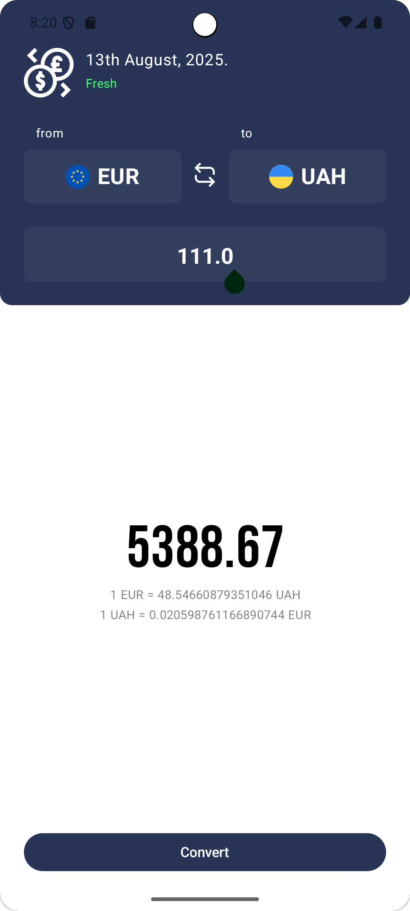
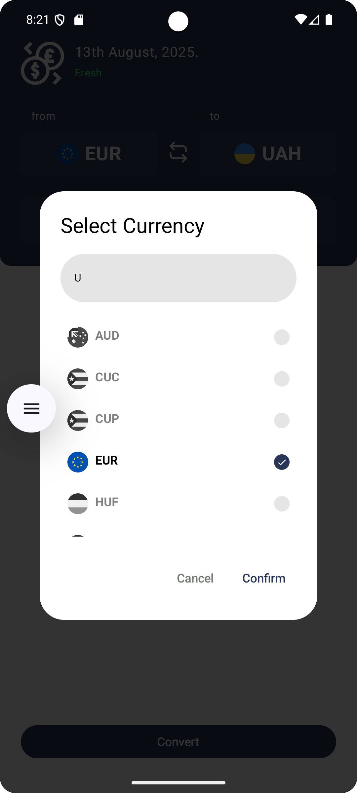

# 💱 Currency App KMP

<div align="center">

A modern **Kotlin Multiplatform** currency converter application with real-time exchange rates,
built with the latest KMP technologies and following clean architecture principles.

[](http://kotlinlang.org)
[](https://www.jetbrains.com/lp/compose-multiplatform/)
[](https://opensource.org/licenses/MIT)

</div>

## ✨ Features

- 💱 **Real-time Currency Conversion** - Get up-to-date exchange rates
- 🌍 **Multiple Currencies** - Support for various international currencies
- 💾 **Offline Support** - Local caching with Realm Database
- 🎨 **Modern UI** - Beautiful Material 3 design with dark/light theme support
- 📱 **Cross-platform** - Runs on Android and iOS from a single codebase
- 🔄 **Persistent Settings** - Save user preferences across sessions

## 📸 Screenshots

<div align="center">
  
  
</div>

## 🏗️ Architecture

This project follows **Clean Architecture** principles with clear separation of concerns:

```
├── presentation/     # UI Layer (Compose UI, ViewModels)
├── domain/          # Business Logic (Use Cases, Models)
├── data/            # Data Layer (Repositories, Data Sources)
│   ├── local/      # Local database (Realm)
│   └── remote/     # API services (Ktor)
├── di/             # Dependency Injection (Koin)
└── util/           # Utilities and Helpers
```

## 🛠️ Tech Stack

### Core Technologies

- **[Kotlin Multiplatform](https://kotlinlang.org/docs/multiplatform.html)** - Share code between
  Android and iOS
- **[Compose Multiplatform](https://www.jetbrains.com/compose-multiplatform/)** - Modern declarative
  UI framework
- **[Material 3](https://m3.material.io/)** - Latest Material Design components

### Libraries & Frameworks

| Library | Purpose | Version |
|---------|---------|---------|
| [Ktor](https://ktor.io/) | HTTP client for API requests | 3.2.3 |
| [Realm](https://realm.io/) | Local database for offline support | 3.0.0 |
| [Koin](https://insert-koin.io/) | Dependency injection | 4.0.3 |
| [Voyager](https://voyager.adriel.cafe/) | Navigation library | 1.0.0 |
| [Kotlinx Serialization](https://github.com/Kotlin/kotlinx.serialization) | JSON parsing | - |
| [Kotlinx DateTime](https://github.com/Kotlin/kotlinx-datetime) | Date/time handling | 0.6.1 |
| [Multiplatform Settings](https://github.com/russhwolf/multiplatform-settings) | Persistent storage | 1.0.0 |

## 🚀 Getting Started

### Prerequisites

- **Android Studio** Ladybug or later (2024.2.1+)
- **JDK** 11 or higher
- **Kotlin** 2.0.21
- For iOS development:
    - **Xcode** 15.0+
    - **CocoaPods** (optional)
    - macOS Ventura or later

### Installation

1. **Clone the repository**
   ```bash
   git clone https://github.com/yourusername/CurrencyAppKMP.git
   cd CurrencyAppKMP
   ```

2. **Open in Android Studio**
    - Open Android Studio
    - Select "Open an Existing Project"
    - Navigate to the cloned directory

3. **Run on Android**
    - Select `composeApp` configuration
    - Choose your device/emulator
    - Click Run ▶️

4. **Run on iOS** (macOS only)
   ```bash
   cd iosApp
   open iosApp.xcodeproj
   ```
   Or run from Android Studio with iOS device/simulator selected

### Configuration

Create a `local.properties` file in the root directory if it doesn't exist:

```properties
sdk.dir=YOUR_ANDROID_SDK_PATH
```

## 📱 Platform Support

| Platform | Status | Min Version |
|----------|--------|-------------|
| Android | ✅ Supported | API 22 (Android 5.1) |
| iOS | ✅ Supported | iOS 14.0+ |
| Desktop | 🚧 Planned | - |
| Web | 🚧 Planned | - |

## 🏛️ Project Structure

```
CurrencyAppKMP/
├── composeApp/              # Shared application code
│   ├── src/
│   │   ├── androidMain/    # Android-specific code
│   │   ├── iosMain/        # iOS-specific code
│   │   └── commonMain/     # Shared code
│   │       └── kotlin/
│   │           └── org.example.currencyapp/
│   │               ├── data/           # Data layer
│   │               ├── domain/         # Domain layer
│   │               ├── presentation/   # UI layer
│   │               ├── di/            # Dependency injection
│   │               └── util/          # Utilities
│   └── build.gradle.kts
├── iosApp/                  # iOS application wrapper
├── gradle/                  # Gradle wrapper
└── build.gradle.kts         # Root build file
```

## 🎯 Key Features Implementation

### 🌐 Network Layer (Ktor)

- RESTful API integration for currency exchange rates
- Content negotiation with JSON serialization
- Platform-specific clients (Android/Darwin)

### 💾 Local Storage (Realm)

- Persistent currency data storage
- Offline-first architecture
- Reactive database queries

### 🧭 Navigation (Voyager)

- Type-safe navigation
- Screen model integration
- Smooth transitions

### 💉 Dependency Injection (Koin)

- Modular DI setup
- Platform-specific implementations
- ViewModel injection support

## 🧪 Testing

```bash
# Run unit tests
./gradlew test

# Run Android tests
./gradlew connectedAndroidTest
```

## 📦 Build

### Android APK

```bash
./gradlew assembleRelease
```

### iOS Build

```bash
cd iosApp
xcodebuild -scheme iosApp -configuration Release
```

## 🤝 Contributing

Contributions are welcome! Please feel free to submit a Pull Request. For major changes, please open
an issue first to discuss what you would like to change.

1. Fork the Project
2. Create your Feature Branch (`git checkout -b feature/AmazingFeature`)
3. Commit your Changes (`git commit -m 'Add some AmazingFeature'`)
4. Push to the Branch (`git push origin feature/AmazingFeature`)
5. Open a Pull Request

## 📝 License

This project is licensed under the MIT License - see the [LICENSE](LICENSE) file for details.

## 👨‍💻 Author

**Your Name**

- GitHub: [@yourusername](https://github.com/yourusername)
- LinkedIn: [Your Name](https://linkedin.com/in/yourprofile)

## 🙏 Acknowledgments

- [JetBrains](https://www.jetbrains.com/) for Kotlin and Compose Multiplatform
- [Exchange Rate API](https://www.exchangerate-api.com/) for currency data
- The amazing Kotlin Multiplatform community

## 📚 Resources

- [Kotlin Multiplatform Documentation](https://kotlinlang.org/docs/multiplatform.html)
- [Compose Multiplatform Documentation](https://github.com/JetBrains/compose-multiplatform)
- [KMP Best Practices](https://kotlinlang.org/docs/multiplatform-mobile-best-practices.html)

---

<div align="center">
Made with ❤️ using Kotlin Multiplatform
</div>
